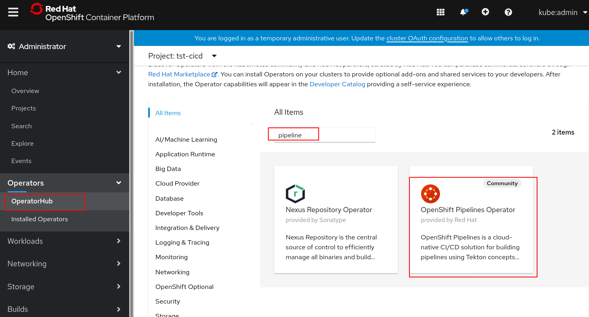
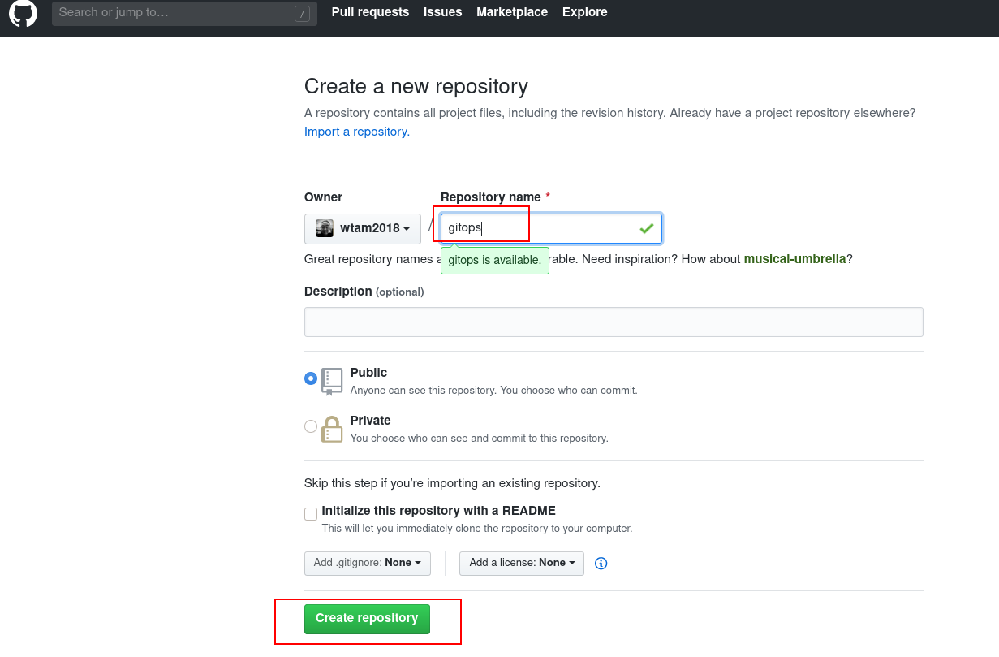
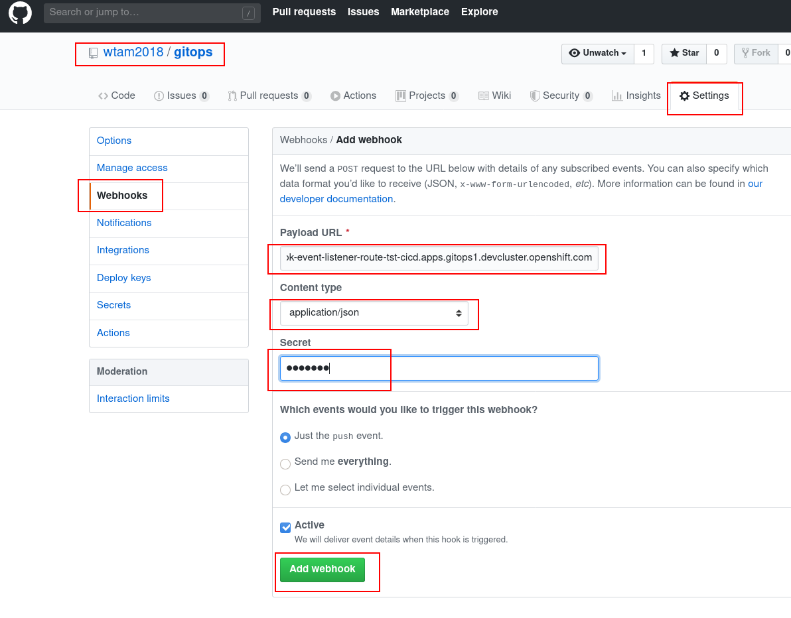
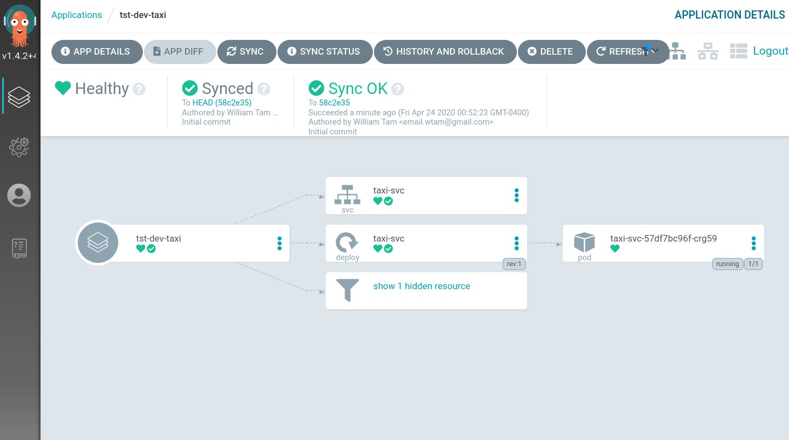

# Manifest Demo Handout

## Install Tekton Operator

Login to OCP Console to install Pipeline Operator

 

## Install sealed secret

* _oc login_ as kubeadmin

```shell
oc apply -f https://github.com/bitnami-labs/sealed-secrets/releases/download/v0.11.0/controller.yaml
```

## Install ArgoCD

```shell
oc create namespace argocd

oc apply -n argocd -f https://raw.githubusercontent.com/argoproj/argo-cd/v1.4.2/manifests/install.yaml

ARGOCD_SERVER_PASSWORD=$(oc -n argocd get pod -l "app.kubernetes.io/name=argocd-server" -o jsonpath='{.items[*].metadata.name}')

PATCH='{"spec":{"template":{"spec":{"$setElementOrder/containers":[{"name":"argocd-server"}],"containers":[{"command":["argocd-server","--insecure","--staticassets","/shared/app"],"name":"argocd-server"}]}}}}'

oc -n argocd patch deployment argocd-server -p $PATCH

oc -n argocd create route edge argocd-server --service=argocd-server --port=http --insecure-policy=Redirect

ARGOCD_ROUTE=$(oc -n argocd get route argocd-server -o jsonpath='{.spec.host}')

argocd --insecure --grpc-web login ${ARGOCD_ROUTE}:443 --username admin --password ${ARGOCD_SERVER_PASSWORD}

# Update admin's password (changeMe)
argocd --insecure --grpc-web --server ${ARGOCD_ROUTE}:443 account update-password --current-password ${ARGOCD_SERVER_PASSWORD} --new-password changeMe
```
Note: New password has been set by the last command which is used to login to ArgoCD web console

### Obtain web address (host/port) of ArgoCD web console by looking up OpenShift Route

```shell
$ oc get route -n argocd
NAME            HOST/PORT                                                    PATH   SERVICES        PORT   TERMINATION     WILDCARD
argocd-server   argocd-server-argocd.apps.gitops1.devcluster.openshift.com          argocd-server   http   edge/Redirect   None
```

## Create GitOps repository in GitHub

Login to your Github account and create a new repository called "gitops"

 

## Fork the taxi app repository

```shell
https://github.com/bigkevmcd/taxi
```

## Clone odo source and compile it

Clone the source to your GOPATH

```shell
$ pwd
/home/wtam/go/src/github.com/openshift
$ git clone https://github.com/rhd-gitops-example/odo.git
$ cd odo
$ make bin
go build -ldflags="-w -X github.com/openshift/odo/pkg/version.GITCOMMIT=f2c35a6c2" cmd/odo/odo.go
```
## Run Manifest Bootstrap Command

* Login to OCP cluster as kubeadmin

```shell
$ pwd
/home/wtam/go/src/github.com/openshift

$ ./odo manifest bootstrap \
--app-repo-url https://github.com/wtam2018/taxi.git \
--app-webhook-secret testing \
--gitops-repo-url https://github.com/wtam2018/gitops.git \
--gitops-webhook-secret testing \
--image-repo quay.io/wtam/taxi \
--dockercfgjson /home/wtam/Downloads/wtam-robot-auth.json \
--prefix tst-  \
--output ~/output
```

Note: Replace your test values for --app-repo-url, --gitops-repo-url, --image-repo, and --dockercfgjson

The following files are generated.
```shell
$ tree ~/output
/home/wtam/output
├── environments
│   ├── tst-argocd
│   │   └── config
│   │       ├── gitops-app.yaml
│   │       ├── kustomization.yaml
│   │       └── tst-dev-taxi-app.yaml
│   ├── tst-cicd
│   │   ├── base
│   │   │   ├── kustomization.yaml
│   │   │   └── pipelines
│   │   │       ├── 01-namespaces
│   │   │       │   └── cicd-environment.yaml
│   │   │       ├── 02-rolebindings
│   │   │       │   ├── pipeline-service-account.yaml
│   │   │       │   ├── pipeline-service-rolebinding.yaml
│   │   │       │   └── pipeline-service-role.yaml
│   │   │       ├── 03-secrets
│   │   │       │   ├── docker-config.yaml
│   │   │       │   ├── github-webhook-secret-taxi-svc.yaml
│   │   │       │   └── gitops-webhook-secret.yaml
│   │   │       ├── 04-tasks
│   │   │       │   ├── deploy-from-source-task.yaml
│   │   │       │   └── deploy-using-kubectl-task.yaml
│   │   │       ├── 05-pipelines
│   │   │       │   ├── app-ci-pipeline.yaml
│   │   │       │   └── ci-dryrun-from-pr-pipeline.yaml
│   │   │       ├── 06-bindings
│   │   │       │   └── github-pr-binding.yaml
│   │   │       ├── 07-templates
│   │   │       │   ├── app-ci-build-pr-template.yaml
│   │   │       │   └── ci-dryrun-from-pr-template.yaml
│   │   │       ├── 08-eventlisteners
│   │   │       │   └── cicd-event-listener.yaml
│   │   │       ├── 09-routes
│   │   │       │   └── gitops-webhook-event-listener.yaml
│   │   │       └── kustomization.yaml
│   │   └── overlays
│   │       └── kustomization.yaml
│   ├── tst-dev
│   │   ├── apps
│   │   │   └── taxi
│   │   │       ├── base
│   │   │       │   └── kustomization.yaml
│   │   │       ├── kustomization.yaml
│   │   │       └── overlays
│   │   │           └── kustomization.yaml
│   │   ├── env
│   │   │   ├── base
│   │   │   │   ├── kustomization.yaml
│   │   │   │   └── tst-dev-environment.yaml
│   │   │   └── overlays
│   │   │       └── kustomization.yaml
│   │   └── services
│   │       └── taxi-svc
│   │           ├── base
│   │           │   ├── config
│   │           │   │   ├── 100-deployment.yaml
│   │           │   │   ├── 200-service.yaml
│   │           │   │   └── kustomization.yaml
│   │           │   └── kustomization.yaml
│   │           ├── kustomization.yaml
│   │           └── overlays
│   │               └── kustomization.yaml
│   └── tst-stage
│       └── env
│           ├── base
│           │   ├── kustomization.yaml
│           │   └── tst-stage-environment.yaml
│           └── overlays
│               └── kustomization.yaml
└── manifest.yaml

33 directories, 38 files
```

## Create Pipeline Resources by `oc apply -k`

```shell
$ cd ~/output
$ oc apply -k environments/tst-cicd/base/
$ oc apply -k environments/tst-dev/env/base/
$ oc apply -k environments/tst-stage/env/base/
$ oc apply -k environments/tst-argocd/config/
```

## Obtain EventListener Address (Host/Port)

```shell
$ oc get route -n tst-cicd
NAME                                  HOST/PORT                                                                            PATH   SERVICES                 PORT   TERMINATION   WILDCARD
gitops-webhook-event-listener-route   gitops-webhook-event-listener-route-tst-cicd.apps.gitops1.devcluster.openshift.com          el-cicd-event-listener   8080                 None
```

Use the EventListener address as "Payload URL" (e.g. http://gitops-webhook-event-listener-route-tst-cicd.apps.gitops1.devcluster.openshift.com) and the webhook secret (testing) to create webhooks for the **gitops** AND **taxi** app repositories.

 


## Push Pipeline Resources to GitOps Repository

```shell
$ cd ~/output
$ git init
$ git add .
$ git commit  -am "Initial commit"
# replace Git URL
$ git remote add origin https://github.com/wtam2018/gitops.git
$ git push -u origin master
```
## Login to ArgoCD web concole 

Use the web address and admin password we obtained in the previous steps to login to ArgoCD web console.  You can see the taxi app has been deployed to `tst-dev` namespace.

 
